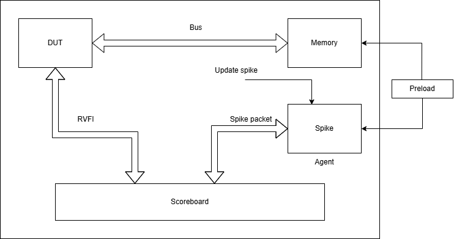

# COCO-RVTB

## Project Summary:
This project aims to provide a generic testbench that allows easy integration with design for functional verification. The testbench uses RVFI interface to gather data packets from the DUT, that will then be compared against Spike packet.

## Workflow
An example worklow could be the following:
1. Preload IMEM and DMEM on Spike and DUT
2. Kick-off execution on DUT and Spike
3. As soon as DUT commits one instruction, i.e. RVFI asserts valid, update spike to execute one instruction.
4. Compare packets
5. Stop execution in case of mismatch

## Challenges
1. Preloading memories:
    - If we use elf, we need to read the text section and the data section and load them in their respective memories
    - If we use binary format we need to generate bins for both memories
2. Implement a bus protocol
    - We need an interconnect to interface DUT and the memories
    - To support Ibex we will implement its bus protocol
3. Connect DUT with the TB interconnect
    - To map the DUT signals with our bus implementation, we can use a yaml file, which will contain the name of the DUT's interface signal names.
    - The TB will use signal names from yaml to connect the two ends (DUT and TB)

## Proof of concept
The inital implementation will contain an Ibex core as DUT. The testbench will implement a bus interface that will connect the memories with Ibex and capture the data of retired instructions through its RVFI interface and compare it with Spike data packet.

Further implementations will support multiple bus protocols that will support most of the open-source RISC-V cores.
