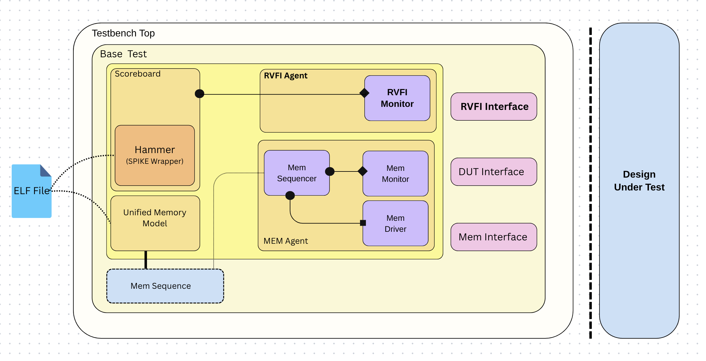

# COCO-RVTB


## Project Summary:

This project aims to provide a generic testbench that allows easy integration with design for functional verification. The testbench uses RVFI interface to gather data packets from the DUT, that will then be compared against Spike packet.

## Workflow

An example worklow could be the following:

1. Preload IMEM and DMEM on Spike and DUT
2. Kick-off execution on DUT and Spike
3. As soon as DUT commits one instruction, i.e. RVFI asserts valid, update spike to execute one instruction.
4. Compare packets
5. Stop execution in case of mismatch

## Challenges

1. Preloading memories:

   * If we use elf, we need to read the text section and the data section and load them in their respective memories
   * If we use binary format we need to generate bins for both memories
2. Implement a bus protocol

   * We need an interconnect to interface DUT and the memories
   * To support Ibex we will implement its bus protocol
3. Connect DUT with the TB interconnect

   * To map the DUT signals with our bus implementation, we can use a yaml file, which will contain the name of the DUT's interface signal names.
   * The TB will use signal names from yaml to connect the two ends (DUT and TB)

## Proof of concept

The inital implementation will contain an Ibex core as DUT. The testbench will implement a bus interface that will connect the memories with Ibex and capture the data of retired instructions through its RVFI interface and compare it with Spike data packet.

Further implementations will support multiple bus protocols that will support most of the open-source RISC-V cores.

## Getting Started

### Prerequisites

* Python 3.8 or higher
* Verilator (for SystemVerilog simulation) - Required for running full simulations
* Git (for submodule management)
* Build tools for compiling submodules (gcc, make, cmake)
* **RISC-V GCC Toolchain** – Required to compile C/C++ source files into RISC-V **ELF binaries**, which are then executed on the simulated Ibex core.(Not required to run the files in `elf_files/`)

  * Make sure it is configured correctly to support for rv32imc
  * For example:

    ```bash
    ./configure --prefix=$HOME/riscv --target=riscv32-unknown-elf \
        --with-arch=rv32imc --with-abi=ilp32 --disable-multilib
    make
    ```

### Installation

1. **Clone the repository with submodules:**

   ```bash
   git clone --recursive https://github.com/ntini773/coco-rvtb.git
   cd coco-rvtb
   ```

   If you already cloned without submodules, initialize them:

   ```bash
   git submodule update --init --recursive
   ```

2. **Install Python dependencies:**

   ```bash
   pip install -r requirements.txt
   ```

### Building

The project uses cocotb with Verilator for simulation.

**Note:** Full simulation requires Verilator to be installed. Install Verilator following the [official installation guide](https://verilator.org/guide/latest/install.html).

**For Hammer co-simulation:** Build the Hammer submodule:

```bash
cd submodules/hammer
# Follow Hammer-specific build instructions
```

One can find the Hammer and Spike build instructions [here](https://github.com/merledu/hammer/blob/main/HAMMER.md).

**Running simulations:** Build and run from the verification directory:

```bash
cd verif
make ELF_PATH=./elf_files/ibex_load_instr_test_0.o
```

### Usage

#### Running Simulations

To run a simulation with a specific ELF file:

```bash
cd verif
make ELF_PATH=./elf_files/ibex_arithmetic_basic_test_0.o
```

Optional: Specify a log file:

```bash
make ELF_PATH=./elf_files/ibex_load_instr_test_0.o LOG_PATH=<your-log-path>
```
A log file will be created at the specified path and it will also be displayed on CLI.

#### Example Files

**Memory Model Test:**
Test the memory model functionality:

```bash
cd verif/utils
python3 test_memory.py
```

This example demonstrates:

* Loading ELF files into memory model
* Reading and writing memory locations
* Memory dumping functionality

**Hammer Co-simulation Example:**
The `hammer_cosim.py` file demonstrates how to use the Hammer RISC-V ISA simulator for co-simulation:

```bash
cd verif/env
python3 hammer_cosim.py
```

*Note: This example requires the Hammer submodule to be built. The Hammer simulator must be compiled before running this example.*

This example demonstrates:

* Initializing a Hammer co-simulation with an ELF file
* Executing instruction steps
* Displaying PC values, instruction strings, and register/memory writes
* Querying processor state
* Synchronous communication with the Hammer subprocess

**Available Test ELF Files:**

* `ibex_arithmetic_basic_test_0.o` - Basic arithmetic operations test
* `ibex_load_instr_test_0.o` - Load instruction test
* `ibex_rand_instr_test_0.o` - Random instruction test
* Additional test files in `verif/elf_files/`


### Generating ELF Files

**Note:**
If you want to generate additional ELF files, you can use the [RISCV-DV](https://github.com/google/riscv-dv) repository. However, the generated ELF files must be compatible with the Ibex core.

For Ibex compatibility, a temporary fork has been prepared: [Ibex-compatible RISCV-DV fork](https://github.com/ntini773/ibex_riscv-dv/tree/master). This fork includes configurations and fixes that allow generating ELF files suitable for Ibex.

Follow the steps mentioned in the [RISCV-DV documentation](https://htmlpreview.github.io/?https://github.com/google/riscv-dv/blob/master/docs/build/singlehtml/index.html#document-index) to set up the environment.

The ELF files in `elf_files/` were generated using RISCV-DV's Python-based generator (`pygen`), which does not require access to licensed commercial simulators.
